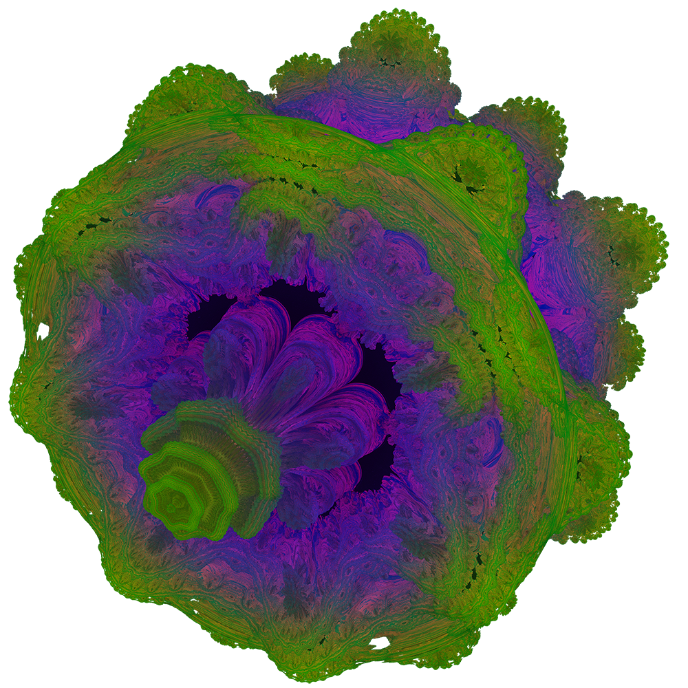

# FMI WebGL course project: Tool for 3D fractal visualizations in real time
## Live at [mdatsev.github.io/webgl-raymarching](https://mdatsev.github.io/webgl-raymarching)!

The project is structured as a lesson on ray marching, to be used for future course editions:

- `1-infinite-spheres.html` - shows the basic ray-marching algorithm with a sphere and the simplest space transformation - mod

- `2-menger-sponge.html` - shows how object can be intersected and combined together to create a more complex fractal. also shows phong lighting and ambient occlusion (which is inexpensive to do with ray marching)

- `3-mandelbulb.html` - uses a well known distance estimator function for the mandelbulb, a generalization of the Mandelbrot set in 3D. also adds colors, smoothing, and camera panning

     

resources:
- idea - http://blog.hvidtfeldts.net/index.php/2011/06/distance-estimated-3d-fractals-part-i/
- ambient occlusion - http://www.visionday.dk/VD09/graphical/slides/Inigo.pdf
- DE of a cube - https://www.youtube.com/watch?v=62-pRVZuS5c
- DE of the madelbulb - http://blog.hvidtfeldts.net/index.php/2011/09/distance-estimated-3d-fractals-v-the-mandelbulb-different-de-approximations, https://www.iquilezles.org/www/articles/mandelbulb/mandelbulb.htm
- combining objects and smoothing - https://www.iquilezles.org/www/articles/distfunctions/distfunctions.htm
- camera rotation - https://stackoverflow.com/questions/14607640/rotating-a-vector-in-3d-space